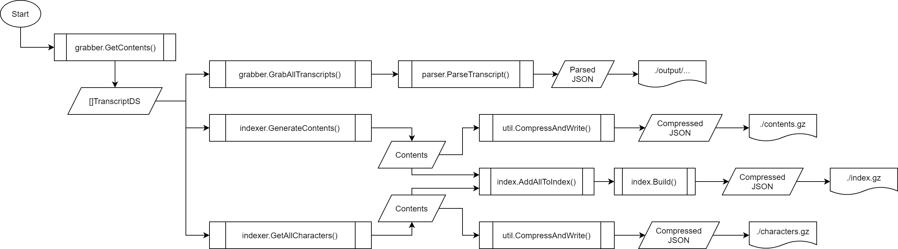

# spongebobsearch
Full text search CLI for SpongeBob transcripts from SpongeBob wiki page

    

## Brief overview

    

## Usage
Run compiled executable file in command promt with one (or more) of the following flags:
| flag                           | commentary                                                              |
|--------------------------------|-------------------------------------------------------------------------|
| -c \| create                   | Grabs SpongeBob transcripts and creates both table of contents and index|
| -s <query> \| search " query " | Searches through the database                                           |
| -r \| rebuild                  | Rebuilds index, tables of contents and grabs SpongeBob transcripts      |
| -g \| goroutines               | Enables multithreading while grabbing transcripts                       |

For the first initialization it is advised to run with -c flag

If you have >1024MB of RAM you could use -g flag to use multithreading while grabbing transcripts
Using this flag on machines with less amount of RAM could cause Out of Memory thus not recommended
